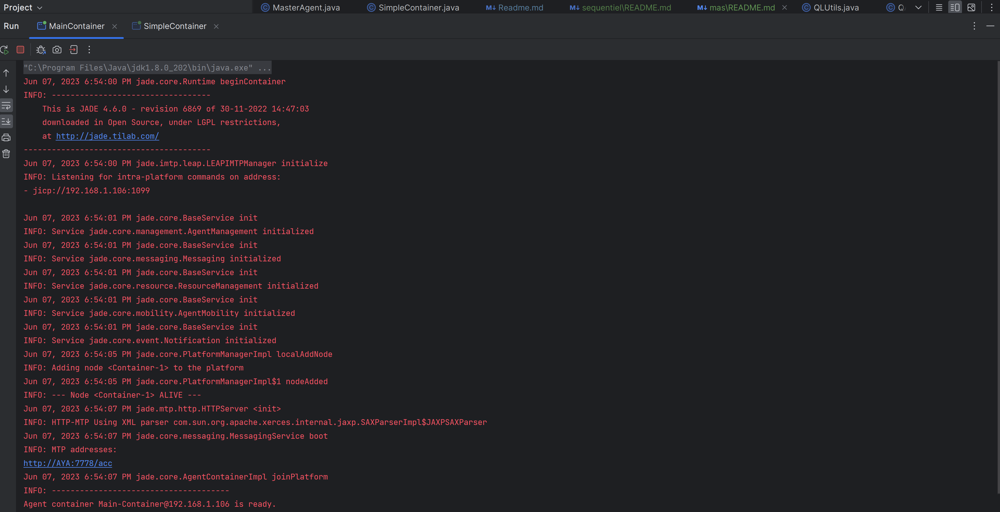
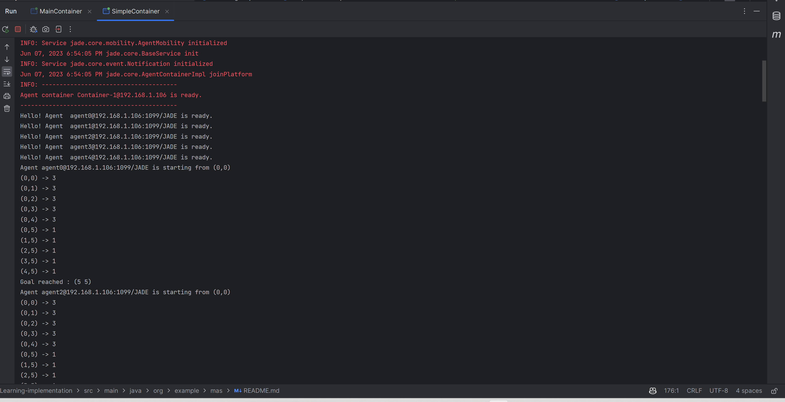
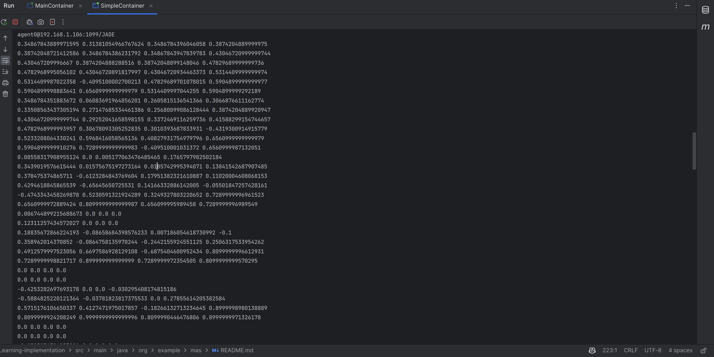

# Implémentation Multi-Agents
 ## Principe adopté
Pour cette implömentation nous avons choisi d'implémenter un agent par case. Les agents ont la les memes actions possible, la meme grlle à résoudre, mais peuvent avoir des points de départ différents.

Chaque agent doit apprendre à résoudre la grille, et donc à trouver le chemin le plus court pour aller de sa case de départ à la case d'arrivée.

Une fois retrouvé, l'agent renvoie le chemin qu'il a trouvé à l'agent central qui va afficher la table de Q-Value de l'agent.

## A faire
- [x] Implémenter Q-Learning MAS
- [ ] Visualiser les résultats
- [ ] Permettre à l'agent central de mettre à jour la table de Q-Value de l'agent pour qu'il puisse apprendre de l'expérience des autres agents.

## Implémentation
### ´QLUtils´
La classe ´QLUtils´ permet de définir des méthodes utiles pour l'implémentation du Q-Learning.
````java
public class QLUtils {
    public static final double ALPHA=0.1;
    public static final double GAMMA=0.9;
    public static final double EPSILON=0.3;
    public static final double MAX_EPOCHS=2000;
    public static final int GRID_SIZE=6;
    public static final int ACTIONS_SIZE=4;

    public static final int[][] ACTIONS={{-1,0},{1,0},{0,-1},{0,1}};
    public static final int[][] GRID={
        //0=rien, -1 obstacte, 1=arrivée
        {0, 0, 0,0,0,0},
        {0, 0, 0, 0,-1,0},
        {0, 0, 0,0,0,0},
        {0, 0, -1,-1,0,0},
        {0, 0, 0,0,0,0},
        {0, 0,0,0,0,1}
    };

    public static final int NUMBER_OF_AGENTS=5;


}
````
### Agent : ´QAgent´
Le QAgent est un agent qui implémente l'interface ´Agent´. Il possède une table de Q-Value et définit les méthodes suivantes :
- void resetState() : remet l'agent dans son état initial
- int chooseAction(double epsilon) : choisit une action en fonction de l'état dans lequel se trouve l'agent et de la valeur de epsilon
- boolean finished() : renvoie true si l'agent a atteint la case d'arrivée
- int executeAction(int action) : exécute l'action choisie et renvoie la récompense associée
- void printBestPath() : affiche le chemin le plus court trouvé par l'agent
- void sendQTable() : envoie la table de Q-Value à l'agent central

### Agent Central : ´MasterAgent´
Le MasterAgent est un agent qui implémente l'interface ´Agent´. Il reçoit les tables de Q-Value des agents et les affiche. 
```java
ACLMessage receivedMessage = receive();
double[][] qTable = new double[GRID_SIZE*GRID_SIZE][ACTIONS_SIZE];
if (receivedMessage != null) {
    //Receive the Q-TABLE from the agent
    System.out.println(receivedMessage.getSender().getName());
    String qTabletring=receivedMessage.getContent();
    String[] rows=qTabletring.split("\n");
    //Remove null in the first row
    rows[0]=rows[0].substring(4);
    for (int i=0;i<rows.length;i++){
        String[] columns=rows[i].split(",");
        for (int j=0;j<columns.length;j++){
            qTable[i][j]=Double.parseDouble(columns[j]);
        }
    }
    //Print the Q-TABLE
    for (int i=0;i<GRID_SIZE*GRID_SIZE;i++) {
        for (int j = 0; j < ACTIONS_SIZE; j++) {
            System.out.print(qTable[i][j] + " ");
        }
        System.out.println();
    }
}
````

### Test de l'implémentation
Pour tester l'implémentation, nous avons créé une classe ´SimpleContainer´ qui permet de lancer le conteneur JADE et d'ajouter les agents.
````java
public class SimpleContainer {
    public static void main(String[] args) throws StaleProxyException {
        Runtime runtime = Runtime.instance();
        ProfileImpl profile = new ProfileImpl();
        profile.setParameter(ProfileImpl.MAIN_HOST, "localhost");
        AgentContainer agentContainer = runtime.createAgentContainer(profile);
        agentContainer.createNewAgent("masterAgent", MasterAgent.class.getName(), new Object[]{}).start();
        for (int i = 0; i < NUMBER_OF_AGENTS; i++) {
            try {
                //Create a new agent with the name "agent" + i and pass on the stateI and stateJ arguments
                agentContainer.createNewAgent("agent" + i, QAgent.class.getName(), new Object[]{}).start();
            } catch (Exception e) {
                e.printStackTrace();
            }
        }

    }
}
````

## Résultats

### MainContainer


### Best Paths
````bash
Hello! Agent  agent0@192.168.1.106:1099/JADE is ready.
Hello! Agent  agent1@192.168.1.106:1099/JADE is ready.
Hello! Agent  agent2@192.168.1.106:1099/JADE is ready.
Hello! Agent  agent3@192.168.1.106:1099/JADE is ready.
Hello! Agent  agent4@192.168.1.106:1099/JADE is ready.
Agent agent0@192.168.1.106:1099/JADE is starting from (0,0)
(0,0) -> 3
(0,1) -> 3
(0,2) -> 3
(0,3) -> 3
(0,4) -> 3
(0,5) -> 1
(1,5) -> 1
(2,5) -> 1
(3,5) -> 1
(4,5) -> 1
Goal reached : (5 5)
Agent agent2@192.168.1.106:1099/JADE is starting from (0,0)
(0,0) -> 3
(0,1) -> 3
(0,2) -> 3
(0,3) -> 3
(0,4) -> 3
(0,5) -> 1
(1,5) -> 1
(2,5) -> 1
(3,5) -> 1
(4,5) -> 1
Goal reached : (5 5)
Agent agent4@192.168.1.106:1099/JADE is starting from (0,0)
(0,0) -> 3
(0,1) -> 3
(0,2) -> 3
(0,3) -> 3
(0,4) -> 3
(0,5) -> 1
(1,5) -> 1
(2,5) -> 1
(3,5) -> 1
(4,5) -> 1
Goal reached : (5 5)
Agent agent1@192.168.1.106:1099/JADE is starting from (0,0)
(0,0) -> 3
(0,1) -> 3
(0,2) -> 3
(0,3) -> 3
(0,4) -> 3
(0,5) -> 1
(1,5) -> 1
(2,5) -> 1
(3,5) -> 1
(4,5) -> 1
Goal reached : (5 5)
Agent agent3@192.168.1.106:1099/JADE is starting from (0,0)
(0,0) -> 3
(0,1) -> 3
(0,2) -> 3
(0,3) -> 3
(0,4) -> 3
(0,5) -> 1
(1,5) -> 1
(2,5) -> 1
(3,5) -> 1
(4,5) -> 1
Goal reached : (5 5)
````



### Q-Tables
````bash
agent0@192.168.1.106:1099/JADE
0.34867843889971595 0.31381054966767624 0.3486784396046058 0.3874204889999975 
0.38742048721412586 0.3486784386231792 0.34867843947839783 0.43046720999999744 
0.430467209996667 0.3874204888288516 0.38742048899148046 0.47829689999999736 
0.4782968995056102 0.43046720891817997 0.43046720934463373 0.5314409999999974 
0.5314409987022358 -0.4095100002700213 0.47829689701078015 0.5904899999999977 
0.5904899998883641 0.6560999999999979 0.5314409997044255 0.5904899999292189 
0.3486784351883672 0.06083691964856201 0.2605815136541366 0.3066876611162774 
0.33508563437305194 0.27147685334461386 0.25680099086128444 0.3874204889920947 
0.43046720999999744 0.29252041658598155 0.3372469116259736 0.41588299154744657 
0.4782968999993957 0.30678093305252835 0.3010393687833931 -0.4319300914915779 
0.5233208064330241 0.5968416058565136 0.40827931754979796 0.6560999999999979 
0.5904899999910276 0.7289999999999983 -0.409510001031372 0.6560999987132051 
0.08558317908955124 0.0 0.005177063476485465 0.1765797982502184 
0.3439019576615444 0.01575675197273164 0.0185742995394071 0.13841542687907485 
0.378475374865711 -0.6123284843769604 0.17951382321610887 0.11020004608068153 
0.4294618845865539 -0.65645650725531 0.14166332886142005 -0.05501847257428161 
-0.4743343458269878 0.5230591321924289 0.3249327803220652 0.7289999996961523 
0.6560999972889424 0.8099999999999987 0.656099995989458 0.7289999996989549 
0.006744899215688673 0.0 0.0 0.0 
0.12311257434572027 0.0 0.0 0.0 
0.18835672866224193 -0.08658684398576233 0.007186054618730992 -0.1 
0.358962014370852 -0.0864758135970244 -0.2442155924551125 0.2506317533954262 
0.4912579997523056 0.6697586928129108 -0.6875404600952434 0.8099999996612931 
0.7289999998821717 0.899999999999999 0.7289999972354505 0.8099999999570295 
0.0 0.0 0.0 0.0 
0.0 0.0 0.0 0.0 
-0.4253282697693178 0.0 0.0 -0.030295408174815186 
-0.5884825220121364 -0.03781823817375533 0.0 0.27855614205382584 
0.5715176106650337 0.4127471975017857 -0.18266132713234645 0.8999998980138889 
0.8099999924208249 0.9999999999999996 0.8099990446476806 0.8999999971326178 
0.0 0.0 0.0 0.0 
0.0 0.0 0.0 0.0 
-0.0323974794257201 0.0 0.0 0.0 
-0.11436621197470764 0.0 -0.002268000000000001 0.0 
0.12503326882122698 0.0 -0.00563646363854688 0.7712320754503901 
0.0 0.0 0.0 0.0 
agent2@192.168.1.106:1099/JADE
0.3486784399275654 0.31381058989300314 0.3486784397029839 0.3874204889999975 
0.38742048839289217 0.34867842151227035 0.348678439939877 0.43046720999999744 
0.43046720998613
````

