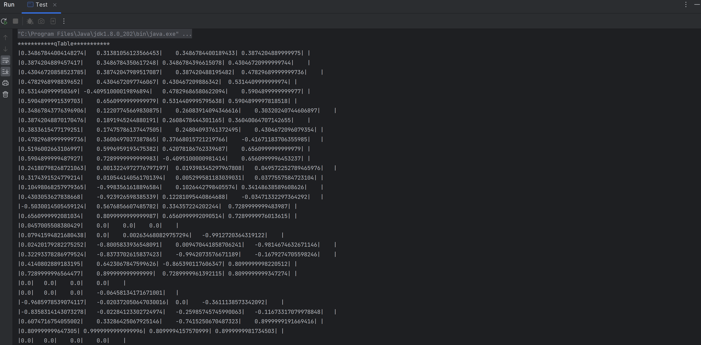
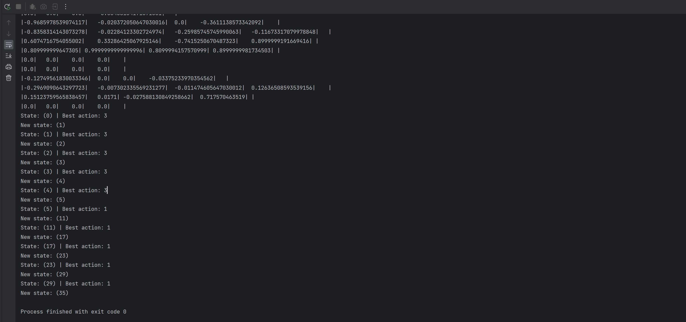

# Q-Learning Implementation

## Principe 
Le problème est le suivant :

Nous essayons de trouver la sortie du labirynthe en partant de la case (0,0) et en se déplaçant dans les 4 directions possibles (haut, bas, gauche, droite).

Le labirynthe est représenté par une grille de 6x6 cases. Les cases sont numérotées de 0 à 35, de gauche à droite et de haut en bas.
(Il est possible de modifier la taille de la grille dans la classe QLUtils)

Voici la grille de départ :

| 0 | 1 | 2 | 3 | 4 | 5 |
|---|---|---|---|---|---|
| 6 | 7 | 8 | 9 | 10| 11|
| 12| 13| 14| 15| 16| 17|
| 18| 19| 20| 21| 22| 23|
| 24| 25| 26| 27| 28| 29|
| 30| 31| 32| 33| 34| 35|

Les cases 10, 14, 15 et 22 sont des obstacles, la case 35 est la sortie.

L'agent reçoit une récompense de 1 s'il atteint la case 35, et une récompense de -1 s'il atteint une case qui n'est pas la case 35.

Représentation de la grille :

| X | 0 | 0  | 0  | 0  | 0 |
|---|---|----|----|----|---|
| 0 | 0 | 0  | 0  | -1 | 0 |
| 0 | 0 | 0  | 0  | 0  | 0 |
| 0 | 0 | -1 | -1 | 0  | 0 |
| 0 | 0 | 0  | 0  | -1 | 0 |
| 0 | 0 | 0  | 0  | 0  | 1 |

La Grille est donc :

````java
public static final int[][] GRID= {
        {0, 0, 0, 0, 0, 0},
        {0, 0, 0, 0, -1, 0},
        {0, 0, 0, 0, 0, 0},
        {0, 0, -1, -1, 0, 0},
        {0, 0, 0, 0, -1, 0},
        {0, 0, 0, 0, 0, 1}
};
````

## Implémentation

- Classe QLUtils : contient les méthodes utiles pour l'implémentation du Q-Learning
````java
public static final double ALPHA=0.1;
public static final double GAMMA=0.9;
public static final double EPSILON=0.3;
public static final double MAX_EPOCHS=2000;
public static final int GRID_SIZE=6;
public static final int ACTIONS_SIZE=4;

public static final int[][] ACTIONS={{-1,0},{1,0},{0,-1},{0,1}};
````

Pour voir la définition des variables, voir le principe dans le [Readme principal](../../../../../../Readme.md).

- Classe QLearning : contient l'implémentation du Q-Learning

````java
private void resetState(); //initialise à la case de départ
private int chooseAction(double epsilon); //choisit une action
 private boolean finished(); //vérifie si l'agent a atteint la case de sortie
private int executeAction(int action); //exécute l'action choisie et retourne la récompense
private void printQTable(); //affiche la Q-Table
public void runQLearning(); //lance l'apprentissage
````

- Classe Test : contient le main et exécute l'apprentissage

````java
public static void main(String[] args) {
        new QLearning().runQLearning();
    }
````

## Résultats

